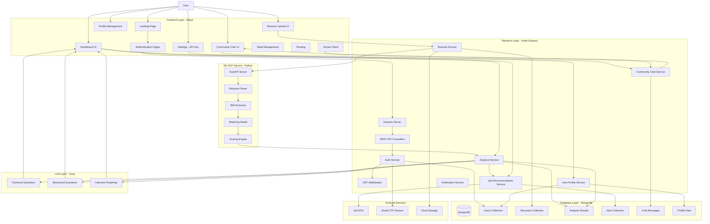

```mermaid
graph TD

%% ================= FRONTEND =================
subgraph FRONTEND ["Frontend Layer - React"]
A1[Landing Page]
A2[Authentication Pages]
A3[Dashboard UI]
A4[Profile Management]
A5[Resume Upload UI]
A6[Community Chat UI]
A7[Settings - API Key]
A8[State Management]
A9[Routing]
A10[Socket Client]
end

%% ================= BACKEND =================
subgraph BACKEND ["Backend Layer - Node Express"]
B1[Express Server]
B2[REST API Controllers]
B3[Auth Service]
B4[JWT Middleware]
B5[Resume Service]
B6[Analysis Service]
B7[Job Recommendation Service]
B8[User Profile Service]
B9[Community Chat Service]
B10[Notification Service]
end

%% ================= DATABASE =================
subgraph DATABASE ["Database Layer - MongoDB"]
C1[(MongoDB)]
C2[Users Collection]
C3[Resumes Collection]
C4[Analysis Results]
C5[Jobs Collection]
C6[Chat Messages]
C7[Profile Data]
end

%% ================= ML SERVICE =================
subgraph ML ["ML NLP Service - Python"]
D1[FastAPI Server]
D2[Resume Parser]
D3[Skill Extractor]
D4[Matching Model]
D5[Scoring Engine]
end

%% ================= LLM =================
subgraph LLM ["LLM Layer - Groq"]
E1[Technical Questions]
E2[Behavioral Questions]
E3[Interview Roadmap]
end

%% ================= EXTERNAL =================
subgraph EXTERNAL ["External Services"]
F1[Job APIs]
F2[Email OTP Service]
F3[Cloud Storage]
end

%% ================= FLOW =================

A1 --> A2
A2 --> B1
A5 --> B5
A6 --> B9
A10 --> B9
A7 --> B8

B1 --> B2
B2 --> B3
B3 --> B4

B3 --> F2
B3 --> C2

B5 --> C3
B5 --> D1

D1 --> D2
D2 --> D3
D3 --> D4
D4 --> D5

D5 --> B6
B6 --> C4

B6 --> B7
B7 --> F1
B7 --> C5

B6 --> E1
B6 --> E2
B6 --> E3

B8 --> C2
B8 --> C7
B6 --> C4

B9 --> C6
B9 --> A6

B5 --> F3

%% USER FLOW
U1[User] --> A1
U1 --> A5
U1 --> A3
U1 --> A4
U1 --> A6
U1 --> A7

A3 --> B6
A3 --> B7

E1 --> A3
E2 --> A3
E3 --> A3
```
