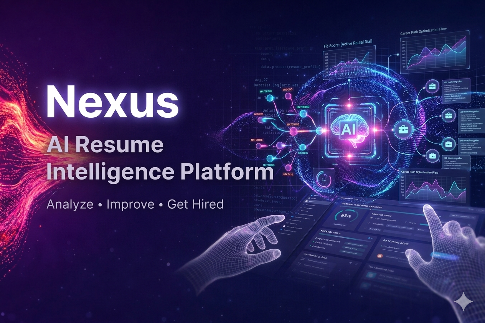
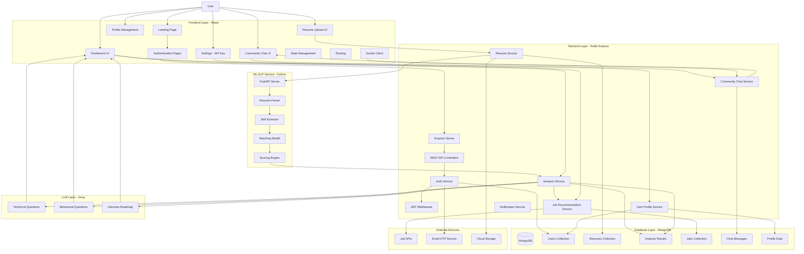

<br/>


# Nexus - AI Resume Analyzer & Interview Platform

> An AI-powered platform that analyzes resumes, detects skill gaps, recommends jobs, and generates personalized interview strategies using ML + LLMs.

---

## Live Demo

🔗 https://resume-analysis-gray-five.vercel.app

---

## Features

### AI Resume Analysis

* NLP-based resume parsing
* Skill extraction & matching
* Resume-to-job compatibility score
* Missing skills detection

### Job Recommendations

* Fetches top matching jobs based on resume
* Direct redirection to job application pages

### AI Interview Preparation (LLM Powered)

* Technical questions generation
* Behavioral questions generation
* Personalized interview roadmap

### Authentication System

* Email OTP verification
* Secure JWT-based authentication
* Forgot password functionality

### Smart Dashboard

* Resume history tracking
* Performance analytics
* Skill improvement insights

### Profile System

* Bio, skills, and career goals
* Social links (LeetCode, GitHub, etc.)
* Custom skill addition

### Community Chat

* Real-time chat (Socket.io)
* Reactions, replies, media sharing
* Toxicity detection (ML model)

### API Key System

* Bring your own Groq API key
* Unlock advanced AI features

---

## 🏗️ Architecture Diagram



---

## Workflow

1. User registers and verifies email via OTP
2. Uploads resume + optional job description
3. ML model analyzes resume:

   * Skill match %
   * Missing skills
   * Career suggestions
4. System fetches job recommendations
5. Optional: Add Groq API key
6. LLM generates:

   * Technical questions
   * Behavioral questions
   * Interview roadmap
7. User tracks progress via dashboard

---

## 📸 Screenshots

### 🏠 Landing Page


### 🔐 Authentication


### 📊 Dashboard


### 📄 Resume Analysis Result


### 👤 Profile Section


### 💬 Community Chat


### ⚙️ Settings (API Key)


---

## 🛠️ Tech Stack

### Frontend

* React.js
* Tailwind CSS / SCSS
* Context API / Redux
* Socket.io Client

### Backend

* Node.js
* Express.js
* JWT Authentication
* REST APIs

### Database

* MongoDB

### AI / ML

* Python (FastAPI)
* NLP (Resume parsing & scoring)
* Custom ML Models

### LLM Integration

* Groq API

### External Services

* Email OTP Service
* Job Scraping APIs
* Cloud Storage

---

## API Endpoints

### Authentication

| Method | Endpoint                  | Description                            |
| ------ | ------------------------- | -------------------------------------- |
| POST   | /api/auth/register        | Register a new user                    |
| POST   | /api/auth/login           | Authenticate user and return token     |
| POST   | /api/auth/logout          | Logout user                            |
| GET    | /api/auth/get-me          | Get current authenticated user details |
| POST   | /api/auth/forgot-password | Send OTP to user's email               |
| POST   | /api/auth/verify-otp      | Verify OTP for password reset          |
| POST   | /api/auth/reset-password  | Reset user password                    |

---

### Resume & Analysis

| Method | Endpoint                   | Description                                                                            |
| ------ | -------------------------- | -------------------------------------------------------------------------------------- |
| POST   | /api/resume/analyze-resume | Analyze resume using NLP model and return match score, missing skills, and suggestions |

---

### Interview (AI + LLM)

| Method | Endpoint                                     | Description                                      |
| ------ | -------------------------------------------- | ------------------------------------------------ |
| POST   | /api/interview                               | Generate interview report from resume (ML + LLM) |
| GET    | /api/interview                               | Get all interview reports for user               |
| GET    | /api/interview/report/:interviewId           | Get specific interview report                    |
| POST   | /api/interview/resume/pdf/:interviewReportId | Generate downloadable resume PDF                 |

---

### Plans / Roadmap

| Method | Endpoint                                         | Description                          |
| ------ | ------------------------------------------------ | ------------------------------------ |
| POST   | /api/plans                                       | Create a new learning/interview plan |
| GET    | /api/plans                                       | Get all user plans                   |
| GET    | /api/plans/:planId                               | Get plan by ID                       |
| PATCH  | /api/plans/:planId/day/:dayIndex/task/:taskIndex | Toggle task completion               |
| POST   | /api/plans/:planId/day/:dayIndex                 | Add new task                         |
| DELETE | /api/plans/:planId/day/:dayIndex/task/:taskIndex | Delete task                          |

---

### Profile

| Method | Endpoint                  | Description              |
| ------ | ------------------------- | ------------------------ |
| POST   | /api/profile/create       | Create user profile      |
| GET    | /api/profile/me           | Get current user profile |
| PUT    | /api/profile/update       | Update profile details   |
| POST   | /api/profile/upload-image | Upload profile image     |

---

### Settings

| Method | Endpoint                    | Description              |
| ------ | --------------------------- | ------------------------ |
| POST   | /api/settings/save-grok-key | Save user's Groq API key |

---

### File Upload

| Method | Endpoint    | Description                        |
| ------ | ----------- | ---------------------------------- |
| POST   | /api/upload | Upload files (resume, media, etc.) |

---

### Admin

| Method | Endpoint             | Description                          |
| ------ | -------------------- | ------------------------------------ |
| GET    | /api/admin/stats     | Get platform statistics (admin only) |
| GET    | /api/admin/users     | Get all users (admin only)           |
| DELETE | /api/admin/users/:id | Delete a user (admin only)           |

---


---

## Installation

### 1. Clone the repository

```bash
git clone https://github.com/your-username/repo-name.git
cd repo-name
```

### 2. Install dependencies

```bash
npm install
```

### 3. Setup environment variables

Create `.env` file:

```env
MONGO_URI=your_mongodb_uri
JWT_SECRET=your_secret
EMAIL_SERVICE_API=your_email_api
GROQ_API_KEY=optional
```

### 4. Run the app

```bash
npm run dev
```

---

## Contribution Guide

1. Fork the repository
2. Create a new branch

```bash
git checkout -b feature-name
```

3. Make changes
4. Commit

```bash
git commit -m "Added new feature"
```

5. Push

```bash
git push origin feature-name
```

6. Open Pull Request

---

## Roadmap

* [ ] LeetCode-style skill grading system
* [ ] AI mock interviews (voice-based)
* [ ] Resume auto-enhancement
* [ ] Recruiter dashboard
* [ ] Analytics improvements

---

## ⭐ Support

If you like this project, please ⭐ the repo!

---

## Author

**Akash Santra**

---
